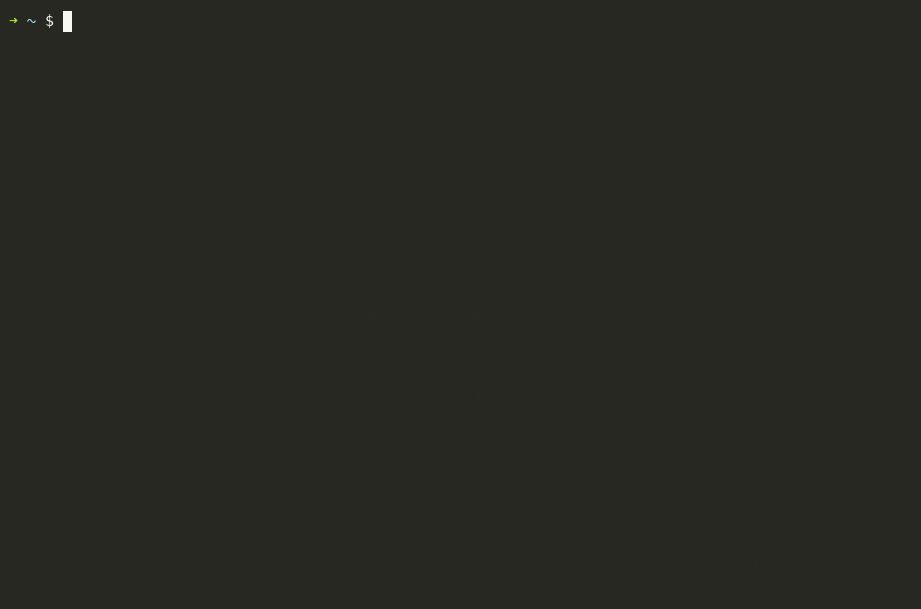

# ag — Agent Gateway

[](https://github.com/yudch999-bot/agent-gateway/actions/workflows/test.yml)
[](LICENSE)
[](https://www.python.org/)

**One command to launch and switch between all your AI coding agents.**

Claude Code, Codex, Gemini, Grok, OpenCode, OpenClaw, Hermes, Pi, Goose, Kimi…
Stop memorizing a dozen different launch commands and a dozen shell aliases.
Put them all behind one fuzzy picker, and add your own by editing one line.



```bash
ag            # 模糊选择器：打字即筛选，回车启动
ag cc         # 直接进 Claude Code
ag ot-design  # 直接进 OpenClaw 的 design 会话
ag cc --resume   # 参数原样透传
```

上面这段录像是**用真实的渲染器生成的**（不是手搓的假动画），
所以画面和真跑逐字节一致 —— 见 [`docs/make-demo-cast.py`](docs/make-demo-cast.py)。

> 📖 想一次看全？**[完整使用指南 →](docs/使用指南.md)**（命令全表、选择器按键、
> 注册表字段、加自定义 agent、排障、FAQ）

---

## 装的东西太多，各有各的启动方式

本机装了 18 个 AI coding agent，启动方式全不一样：

- 有的命令名就是启动指令（`codex`、`gemini`、`goose`）
- 有的靠 shell 别名（`cc`→`claude`、`oc`→`opencode`、`d`→`dsh-tui`）
- 多会话的还得敲一长串（`openclaw tui --session agent:design:main`）
- 想加一个新的，就得改 `.zshrc`、重开 shell、再记住一个别名

`ag` 把这些收在一处：

| 原来的麻烦 | 现在 |
|---|---|
| N 套启动方式要分别记 | `ag` 一个命令，选就行 |
| 长命令记不住 | `ag ot-design` |
| 加新 agent 要动 `.zshrc` | `ag add`，存完立刻生效 |
| 装了但忘了叫什么 | `ag scan` 扫出来 |
| 不知道哪个还能跑 | `ag doctor` 体检 |

**原有的 shell 别名一个都不用删**，`ag` 是加在上面的一层。

---

## 安装

一条命令（会装到 `~/.local/bin/ag`，并在 `~/.zshrc` 追加一段 source）：

```bash
curl -fsSL https://raw.githubusercontent.com/yudch999-bot/agent-gateway/main/install.sh | bash
```

或者手动：

```bash
git clone https://github.com/yudch999-bot/agent-gateway.git
cd agent-gateway
./install.sh
```

**依赖**：Python 3.11+（用了标准库 `tomllib`）、zsh（可选，只为补全）。
除此之外**零第三方依赖**，不用 pip install 任何东西。

装完开个新终端，敲 `ag` 试试。

---

## 用法

### 启动

| 命令 | 作用 |
|---|---|
| `ag` | 打开模糊选择器 |
| `ag <id>` | 精确启动，例 `ag cc` |
| `ag <id> [参数...]` | 参数透传给 agent，例 `ag cc --resume` |
| `ag <关键词>` | 没精确匹配时，打开预填关键词的选择器 |

### 选择器

```
  ag Agent Gateway  32/32 · 选一个 agent · 输入即筛选
  ❯ ce█
  ────────────────────────────────────────────────────────────
  ● ot-ceo        OpenClaw · ceo 内容策划          内容策划
  ● ot-finance    OpenClaw · finance 社群运营       社群运营
  ● oc            OpenCode                         开源终端编码 agent
  ────────────────────────────────────────────────────────────
  openclaw tui --session agent:ceo:main  tags: openclaw,team
  ↑↓/Ctrl-P,N 移动 · Enter 启动 · Esc 退出 · Ctrl-U 清空
```

| 按键 | 作用 |
|---|---|
| 直接打字 | 追加筛选词（**支持中文**） |
| `↑` `↓` / `Ctrl-P` `Ctrl-N` | 移动 |
| `PgUp` `PgDn` / `Home` `End` | 翻页 / 跳首尾 |
| `Backspace` / `Ctrl-U` | 删一字 / 清空 |
| `Enter` / `Esc` | 启动 / 退出 |

搜索范围：**短名、显示名、说明、标签、别名**，中英文都行。

```
ag 设计        →  ot-design
ag 文案写手     →  ot-dev
ag wrapper     →  omc / omx
ag deepseek    →  d
```

排序：精确短名 > 短名前缀 > 短名含 > 显示名前缀 > 别名前缀 > 主字段含 > 仅在标签/说明中命中（沉底）。

行首 **绿点 `●` = 能找到可执行文件，红圈 `○` = 没装**，选中缺失项时底部会显示安装命令。

### 管理

| 命令 | 作用 |
|---|---|
| `ag ls` | 列出全部（`--all` 含隐藏项，`--json` 机器可读） |
| `ag add` | 向导式添加 |
| `ag rm <id>` | 删除（保留注释，自动备份） |
| `ag edit` | 用 `$EDITOR` 打开注册表 |
| `ag scan` | 扫描 `PATH`，找出装了但没登记的 |
| `ag doctor` | 体检：逐条解析真实路径 |
| `ag install <id>` | 按登记的 `install` 命令安装 |
| `ag install --missing` | 一键补装所有缺失的 |
| `ag which <id>` | 看实际会执行什么、在哪 |
| `ag path` | 打印注册表路径 |

---

## 加自己的 agent

### 向导

```bash
ag add
```

### 一行

```bash
ag add --id myagent --cmd myagent --name "My Agent" \
        --desc "干什么的" --tags "自研,内部" --alias ma
```

### 直接改注册表

`ag edit`，追加一块，**保存即生效，不用重开 shell**：

```toml
[[agent]]
id = "myagent"                # 必填，唯一短名，就是 `ag myagent` 敲的那个
name = "My Agent"             # 显示名
cmd = "myagent"               # 必填，可执行文件名或绝对路径
args = ["--flag", "value"]    # 固定参数，每次启动都带
desc = "一句话说明"
tags = ["自研", "内部"]        # 标签，可被搜索
alias = ["ma", "mine"]        # 额外别名
env = { API_KEY = "sk-xxx" }  # 启动时注入的环境变量
cwd = "~/work"                # 启动目录，支持 ~
install = "npm i -g myagent"  # 给 `ag install` 用
hidden = false                # true 则不进选择器
```

它本质就是个**带参数的启动器**，非 AI 的命令也能收：

```bash
ag add --id k9s --cmd k9s --desc "K8s 面板"
ag add --id gp --cmd git --args "pull --rebase" --desc "拉取变基"
```

---

## 进阶

### 用另一份注册表

```bash
export AG_REGISTRY=~/proj/agents.toml
ag ls
```

`ag` 本体、补全、备份目录都会跟着走。适合给单个项目配一套入口。

### Ctrl-G 快捷键

`ag.zsh` 会绑定 `Ctrl-G`，在任意命令行提示符下直接召唤选择器。不想要：

```zsh
export AG_NO_KEYBIND=1
```

### 和 cc-switch 的分工

不冲突，建议并用：

| | 管什么 |
|---|---|
| **cc-switch** 等 provider 切换器 | 同一个 agent 换**供应商 / 模型 / API Key** |
| **ag** | 换**哪个 agent**，以及怎么启动它 |

`ag` 负责把进程拉起来，拉起来之后走哪家 API 仍然归切换器管。

---

## 开发

主程序是单文件 `ag`（Python 标准库，无第三方依赖）。改完跑全套：

```bash
bash tests/lint.sh            # 静态检查
python3 tests/test_ag.py      # 主程序回归测试
bash tests/test_install.sh    # 安装脚本回归测试（临时 HOME，不碰真环境）
```

| 测试 | 覆盖什么 |
|---|---|
| `tests/lint.sh` | `$VAR` 后紧跟多字节字符、shell 语法、可执行位、密钥扫描、shellcheck |
| `tests/test_ag.py` | 假终端驱动选择器（**不需要真 pty**）：渲染帧、终端还原、按键导航、中英文与标签搜索排序、别名解析、TOML 特殊字符往返、注册表完整性 |
| `tests/test_install.sh` | 全新 HOME 安装、重复安装幂等、老式标记行识别、已有注册表不被覆盖 |

本机装齐了全套 agent 的，可以加 `AG_EXPECT_ALL_INSTALLED=1` 让它额外校验每个可执行文件都解析得到。

### 为什么有 `lint.sh` 第 1 项

这个项目真踩过：`"源文件：$RAW（远程下载）"` 里 `$RAW` 后面紧跟全角括号 `（`，
某些 locale 下 bash 会把多字节字符吞进变量名，运行时报 `RAW?: unbound variable`，
而 **`bash -n` 完全查不出来**。修法一律写成 `${RAW}`。lint 第 1 项就是抓这个。

### 重新生成 README 里的演示

有两种方式：

```bash
python3 docs/make-demo-cast.py    # 不需要终端，可复现，CI 友好
bash docs/record-demo.sh          # 开真 asciinema 会话，你亲手敲
```

第一种拿 `ag` 真正的渲染器跑一遍，把每帧输出连时间戳录成
[asciinema cast](https://docs.asciinema.org/manual/asciicast/v2/)，
所以**画面和真实运行逐字节一致**，而且不需要 pty、不需要人操作。
第二种适合录进自己的真实环境。

两种都产出 `.cast`，再转 GIF：

```bash
agg --font-size 15 --theme monokai docs/demo.cast docs/demo.gif
```

---

## 文件

```
ag                       主程序（Python 标准库，零依赖）
registry.example.toml    注册表模板，install.sh 会复制成 ~/.agents/registry.toml
ag.zsh                   zsh 补全 + Ctrl-G 快捷键
install.sh               安装脚本（幂等，支持 curl | bash）
docs/使用指南.md          完整使用手册
docs/demo.cast           演示录像（asciinema 格式）
docs/demo.gif            README 里那张图
docs/make-demo-cast.py   从真实渲染器生成录像
docs/record-demo.sh      开真终端录一段
tests/lint.sh            静态检查
tests/test_ag.py         主程序回归测试
tests/test_install.sh    安装脚本回归测试
```

运行时目录：

```
~/.local/bin/ag                主程序
~/.agents/registry.toml        你的注册表
~/.agents/ag.zsh               zsh 集成
~/.agents/backups/             注册表自动备份（保留最近 20 份）
```

---

## FAQ

**改了注册表要重启 shell 吗？**
不用。`ag` 每次运行重读注册表。只有改 `.zshrc` 才需要 `source ~/.zshrc`。

**启动报「找不到可执行文件」？**
那条的 `cmd` 不在 `PATH` 上。`cmd` 可以直接写绝对路径，或把它的 bin 目录加进 `PATH`。先 `ag doctor` 看哪条断了。

**短名和子命令重名了？**
子命令优先。登记一个短名叫 `ls` 的 agent，`ag ls` 会走子命令而不是启动它。换个短名。

**想同时跑好几个 agent？**
每个 `ag <id>` 是独立进程，开几个终端窗口即可。要多窗格同屏用 tmux，每个 pane 里 `ag <id>`。

---

## License

MIT
